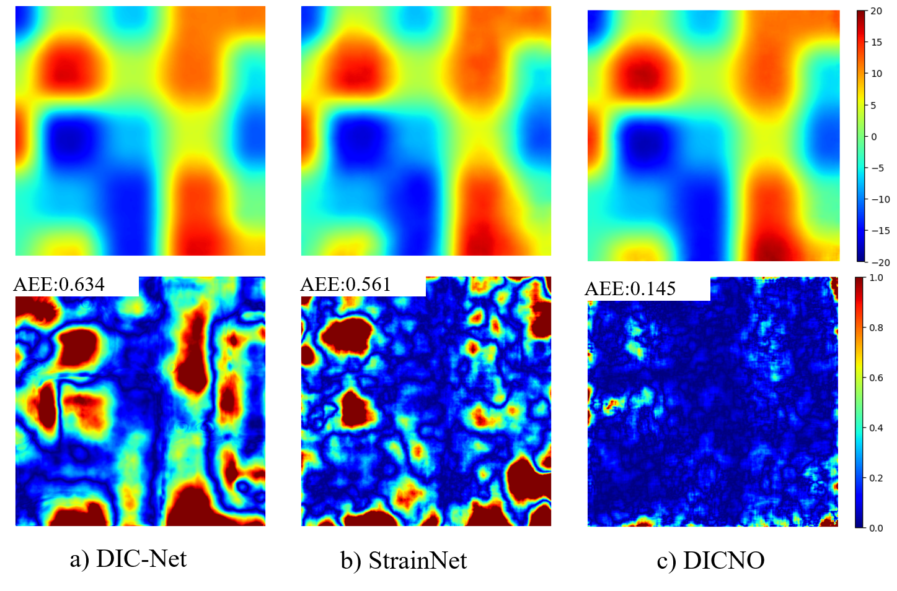
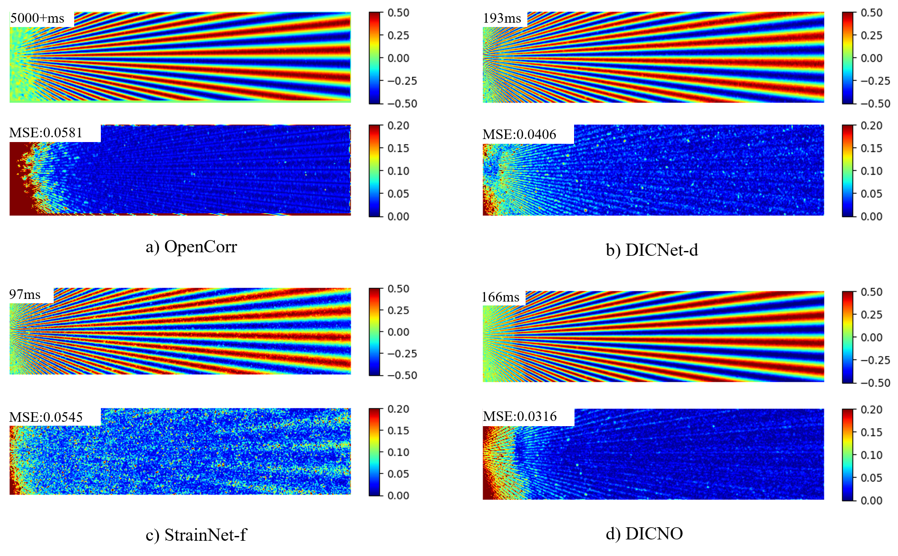
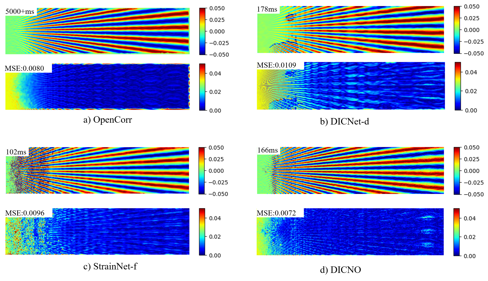

# DICNO
This repository contains the official implementation for Digital Image Corrlation Neural Operator.

## Example Output

- **Large Displacement Prediction**: The model predicts displacement values within the range of [-20, 20].

- **Star Displacement Comparison**: star displacement predictions of four different models.

- **Star Strain Comparison**: star strain predictions from four different models.

## Pre-trained Weights
Download the pretrained model from [here](https://drive.google.com/file/d/1fR9LYgVw-W8PxQr_zVYZL45TAfB7FJVA/view?usp=drive_link)

## Upcoming Open Source Release
We will open-source the complete code for DICNO following the acceptance of our paper. 

## Acknowledgement
This code is built on [SRNO](https://github.com/2y7c3/Super-Resolution-Neural-Operator) and [DIC-Net](https://github.com/YinWang20/DIC-Net)